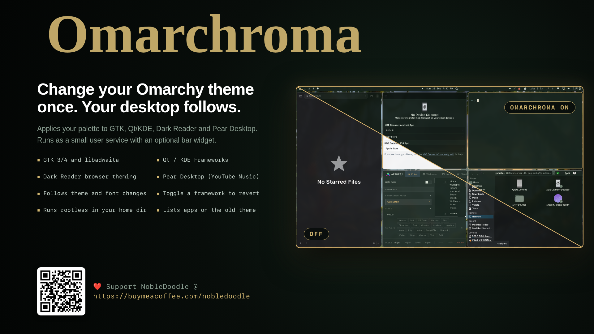
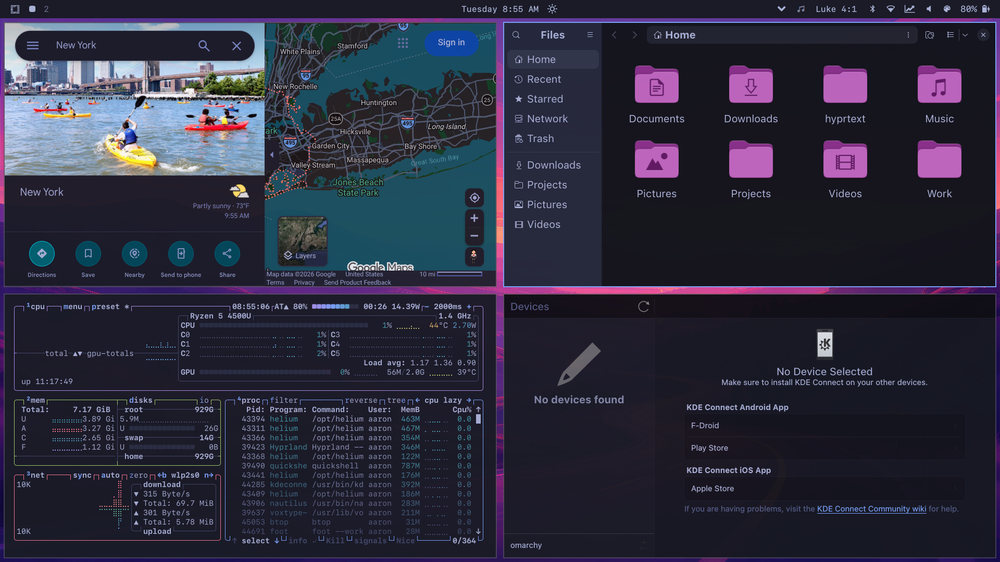
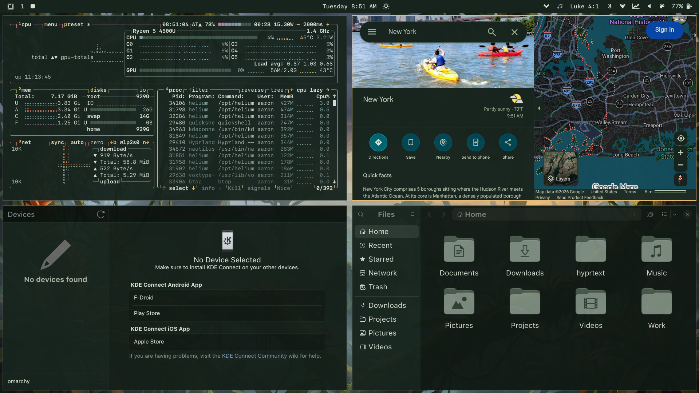
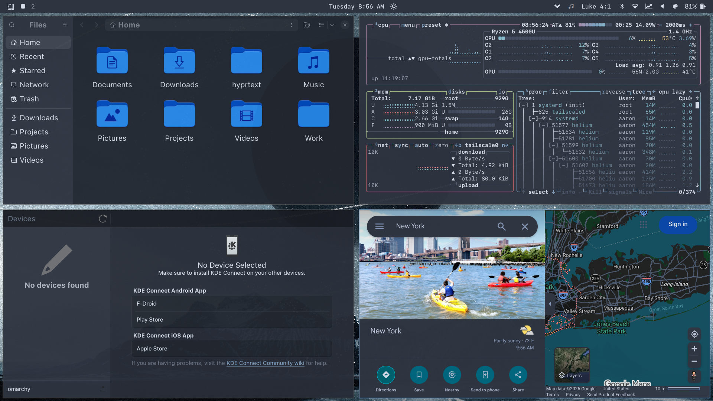

# Omarchroma



**Change your Omarchy theme once and let the rest of your desktop follow.**

Omarchroma is an Omarchy service and bar widget that carries the active
Omarchy palette into applications that do not otherwise follow it completely.
It synchronizes GTK and GNOME, Qt and KDE Frameworks, Dark Reader in the
default Chromium- or Firefox-family browser, and Pear Desktop/YouTube Music.

In the bar it stays simple: one palette icon. Click it to open a compact
framework menu with per-framework on/off toggles and a refresh-enabled action;
automatic synchronization happens in the background whenever the Omarchy theme
changes for frameworks that are switched on.

## Showcase

Omarchroma carries one Omarchy palette across desktop applications, browser
content, toolkit widgets, and app-specific styles.



The bar widget exposes each integration as a toggle. Turning a framework on
refreshes it immediately; turning it off keeps future theme changes from
touching that framework.

| Theme | What it shows |
|---|---|
|  | GTK/libadwaita, Qt/KDE surfaces, Dark Reader, and Pear styling following a custom Omarchy palette. |
|  | The same app set following a Nord palette after an Omarchy theme change. |

## Install

```bash
omarchy plugin add https://github.com/NobleDoodle/omarchroma
~/.config/omarchy/plugins/io.github.nobledoodle.omarchroma/install.sh --enable
```

The first command installs the plugin through Omarchy. The second installs its
commands and native `theme-set` hook, adds missing dependencies, configures
Dark Reader for the default browser, enables the service, and places the
palette icon in the right bar section immediately before the power widget. If
Dark Reader is already installed in the active browser profile on first
install, Omarchroma leaves extension installation unmanaged and only
synchronizes its settings.

Before changing files, `install.sh` prints an explicit consent notice and
requires typing `I understand`. The notice explains that the installer may:

- install the outside packages `adw-gtk-theme` and `python-plyvel`
- copy the plugin into `~/.config/omarchy/plugins/io.github.nobledoodle.omarchroma`
- overwrite Omarchroma command shims in `~/.local/bin`
- install the Omarchy `theme-set` hook
- remove stale Omarchroma compatibility hook shims and the unused
  `assets/dark-reader-policy.json` left by earlier versions
- snapshot original state in `~/.local/state/omarchroma/original/`
- configure Dark Reader browser policy when Omarchroma needs to install it,
  keeping a root-owned backup of each replaced policy file under
  `/var/lib/omarchroma/policy-backup/`
- clear per-application KDE color scheme pins (`[UiSettings] ColorScheme` in
  `~/.config/*rc`), recording each original value for the uninstaller
- run the initial sync for enabled GTK/GNOME, Qt/KDE, Dark Reader, and Pear
  Desktop integrations
- enable the bar widget when `--enable` is used

The shell hot-reloads; no restart is required. To install without adding the
bar icon:

```bash
~/.config/omarchy/plugins/io.github.nobledoodle.omarchroma/install.sh
```

## Removal

```bash
~/.config/omarchy/plugins/io.github.nobledoodle.omarchroma/uninstall.sh
```

The uninstaller removes the plugin, commands, hook, and bar integration.
It also restores the GTK, GNOME, Qt/KDE, Pear Desktop, Dark Reader, and
browser policy state captured before Omarchroma first changed each
integration. If Dark Reader was already installed when Omarchroma was
installed, uninstall restores its original settings and does not remove the
extension. Dark Reader restore requires the target browser to be closed,
matching the sync path's LevelDB safety rule.

The system browser policy is restored by a fixed privileged helper that
rederives each policy path from the built-in browser allowlist and replays the
root-owned backup under `/var/lib/omarchroma/policy-backup/` only after
verifying its digest; it prompts for administrator authentication and never
runs a user-writable script. One backup is recorded per policy destination, so
if the default browser changed while Omarchroma was installed, every policy
file it wrote is restored or removed, with the permissions and ownership it
had before Omarchroma replaced it. The backup directory is removed once the
restore succeeds. If the backup record is missing the uninstaller does not
guess: it names the policy files it left in place so they can be reviewed.

## Requirements

| Dependency | Why | Where it comes from |
|---|---|---|
| `adw-gtk-theme` | GTK 3 compatibility with GTK 4/libadwaita | Arch package; installed by `install.sh` |
| `python-plyvel` | safe Chromium Dark Reader LevelDB updates | Arch package; installed by `install.sh` |

Everything else Omarchroma uses ships with Omarchy or the base system it
provides.

Omarchroma does not install Kvantum, `qt5ct`, or `qt6ct`. Omarchy intentionally
uses `QT_QPA_PLATFORMTHEME=gtk3` so ordinary Qt 5 and Qt 6 widgets inherit the
synchronized GTK palette.

## Layout

```text
manifest.json                    service + bar-widget plugin manifest
BarWidget.qml                    palette button and manual sync action
Panel.qml                        framework toggle panel opened by the widget
Service.qml                      startup and one-minute recovery sync
bin/omarchroma-sync              synchronization orchestrator
bin/omarchroma-dark-reader       browser/profile detection and Dark Reader updater
bin/omarchroma-state             snapshot and restore helper
hooks/omarchroma                 native theme-set hook
lib/sync-gtk-theme               GTK 3/4 and libadwaita palette generator
lib/sync-qt-kde-theme            Qt/KDE color-scheme generator
assets/pear-theme.css.template   Pear Desktop stylesheet template
install.sh                       standalone installer
uninstall.sh                     integration cleanup
```

## What synchronization does

| Target | Result |
|---|---|
| GTK 3 | complete widget, surface, selection, and semantic palette |
| GTK 4/libadwaita | matching CSS variables, surfaces, cards, dialogs, and controls |
| GNOME settings | dark/light mode, `adw-gtk3`, icon theme compatibility, and nearest accent |
| Qt 5/Qt 6 | follows the generated GTK palette through Omarchy's platform-theme bridge |
| KDE Frameworks | generated `Omarchroma.colors` plus applied `kdeglobals` color groups; per-application color scheme pins are cleared so no app opts out, and running apps are notified through `KConfigWatcher` |
| Dark Reader | dynamic theme, selection, focus, scrollbar colors, and custom CSS applied by default without dark-site detection |
| Pear Desktop | generated and registered YouTube Music stylesheet |

The native `theme-set` hook applies changes immediately. A lightweight service
checks once per minute for a missed event, a changed default browser, a newly
installed Pear Desktop, or a Dark Reader update waiting for the browser to
close. A runtime lock prevents overlapping hook, service, and manual runs.

## Browser support

Omarchroma detects the current default browser through XDG settings and
supports:

- Helium
- Chromium
- Google Chrome
- Brave
- Vivaldi
- Microsoft Edge
- Firefox
- Firefox Developer Edition
- LibreWolf
- Waterfox
- Floorp
- Zen Browser

For Chromium-family browsers, Omarchroma installs Dark Reader through the
browser's managed-extension policy and updates the extension's active profile
LevelDB. For Firefox-family browsers, it installs Dark Reader through the
browser's `policies.json` when needed and updates the active profile's
`storage-sync-v2.sqlite` settings for `addon@darkreader.org`. Browser extension
settings are never modified while the target browser is running; the update is
marked `pending-browser-exit` and retried after the browser closes.

## Files written

```text
~/.config/gtk-3.0/
~/.config/gtk-4.0/
~/.config/kdeglobals
~/.config/YouTube Music/omarchroma.css
~/.local/share/color-schemes/Omarchroma.colors
~/.local/share/omarchroma/dark-reader-theme.json
~/.local/state/omarchroma/original/
~/.local/state/omarchroma/settings.json
~/.local/state/omarchroma/status.json
~/.config/*rc                        (only the [UiSettings] ColorScheme key, removed)
/var/lib/omarchroma/policy-backup/   (root-owned; only when a browser policy is installed)
```

Unrelated GTK, KDE, Pear Desktop, and browser settings are preserved.

## Interactions

| Input | Action |
|---|---|
| left click palette icon | open or close the framework refresh menu |
| GTK and GNOME toggle on | enable and refresh GTK 3/4, libadwaita, and GNOME settings |
| Qt and KDE toggle on | enable and refresh the Qt/KDE palette |
| Dark Reader toggle on | enable and refresh the selected browser's Dark Reader theme |
| Pear Desktop toggle on | enable and refresh Pear Desktop's stylesheet |
| any framework toggle off | disable that framework for manual, service, and theme-hook sync |
| Refresh enabled | refresh every currently enabled supported framework |
| `omarchy-shell io.github.nobledoodle.omarchroma open` | open the framework refresh menu over IPC |
| `omarchy-shell io.github.nobledoodle.omarchroma refresh` | open the framework refresh menu over IPC |
| `omarchy-shell io.github.nobledoodle.omarchroma-service sync` | invoke the background service over IPC |

## CLI

```bash
omarchroma-sync                   # sync only when state changed
omarchroma-sync --force           # force all generators to run
omarchroma-sync --force --notify  # force sync and show a desktop notification
omarchroma-sync --target=gtk --force
omarchroma-sync --target=qt-kde --force
omarchroma-sync --target=dark-reader --force
omarchroma-sync --target=pear --force
omarchroma-sync --target=dark-reader --set-enabled=true
omarchroma-sync --target=dark-reader --set-enabled=false
omarchroma-sync --quiet           # suppress normal command output
omarchroma-dark-reader --info     # show detected browser and policy path as JSON
```

## License

[MIT](LICENSE)
