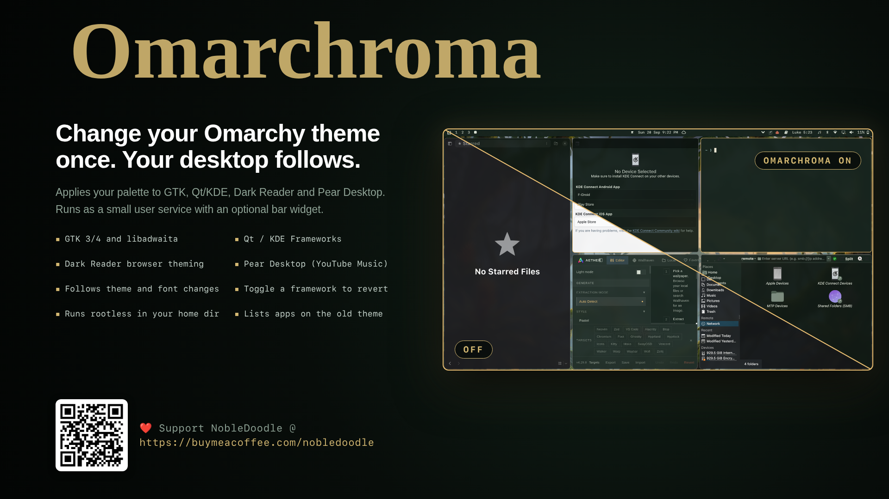
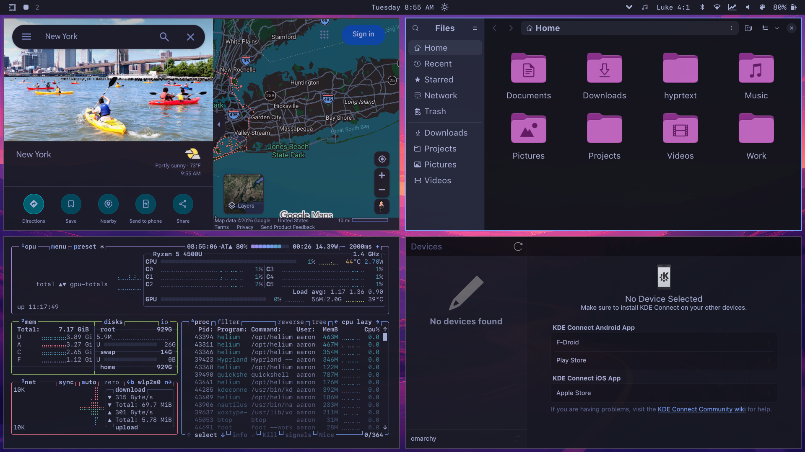
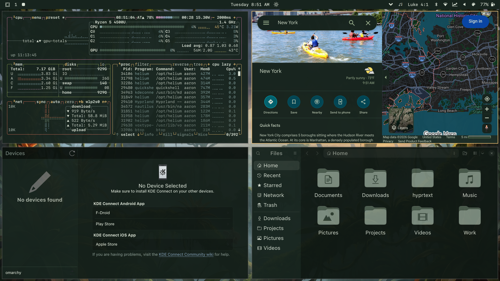
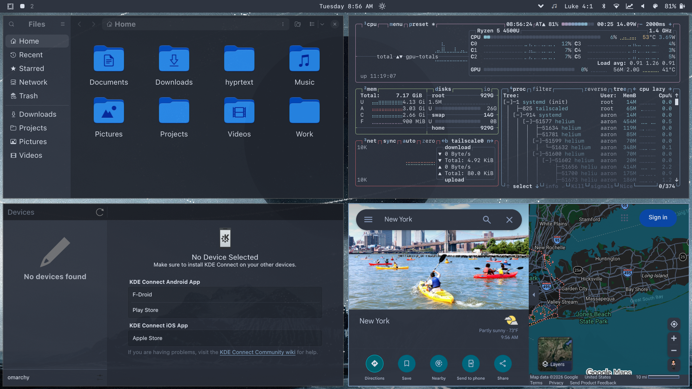

# Omarchroma



**Change your Omarchy theme once and let your desktop follow.**

Omarchroma applies your active palette to GTK 3/4, libadwaita, GNOME settings,
Qt/KDE Frameworks, Dark Reader, Pear Desktop (YouTube Music), Flatpak apps, and
the browsers Omarchy does not theme itself: Firefox, Floorp, Zen, LibreWolf,
Waterfox and Vivaldi.

It runs as a standalone user service (`hyprchroma`) with an optional Omarchy
bar widget for convenience.

## Install

**With the bar widget:**

```bash
omarchy plugin add https://github.com/NobleDoodle/omarchroma --enable
```

Open the panel and press **i**. A setup terminal shows what is new in this
version, prompts you to select optional frameworks and whether to restart apps
at theme change, then verifies the dependencies those need. Type
`I understand` to build.

**Standalone (service only):**

```bash
git clone --depth 1 https://github.com/NobleDoodle/omarchroma
cd omarchroma/packaging && makepkg -si
systemctl --user enable --now hyprchromad.service
```

Updating this way, re-run the same three commands. `enable --now` only starts
the service if it was not already running, so on an update it keeps executing
whatever it had already loaded — add `systemctl --user restart hyprchromad.service`
afterward to pick up the new build. The bar widget's setup terminal offers
this restart, and the Omarchy shell's own, automatically.

## Showcase



| Theme | What it shows |
|---|---|
|  | GTK/libadwaita, Qt/KDE surfaces, Dark Reader, and Pear Desktop following a custom palette. |
|  | The same app set following a Nord palette after a theme change. |

## Use

```bash
hyprchroma                        # sync only what changed
hyprchroma --force                # rewrite everything
hyprchroma --target=gtk --force   # gtk | qt-kde | dark-reader | pear | flatpak | browsers
hyprchroma framework remove pear  # remove from the panel and revert
hyprchroma framework restore pear # put it back and sync
hyprchroma palette --capture      # pin the current palette to a file
hyprchroma restore --stock        # revert everything to stock defaults
hyprchroma restart-stale          # close and relaunch every stale application
hyprchroma --restart-mode=confirm # confirm | off -- see below
```

With the bar widget:

| Input | Action |
|---|---|
| Left click palette icon | Open/close the panel |
| `1` – `6` | Toggle kept frameworks |
| `r` | Refresh every enabled framework |
| `/` | Show apps still using the old theme |
| `a` (in that list) | Review a restart of them: lists what will close, then Ctrl+Enter to go ahead |
| `Ctrl+Enter` (in that review) | Close and relaunch them |
| `s` | Settings |
| `?` | Help: open the issues page to report a problem or ask a question |
| `c` (in Settings) | Restart apps at theme change: on (always asks first, Ctrl+Enter to go ahead) / off |
| `1` – `4` (in Settings) | Show an optional framework in the panel, or remove it |
| `i` | Install, update, or start hyprchroma when prompted |
| `Esc` | Go back or close the panel |

* While applications are still showing the previous theme, the icon takes your
  theme's alert color with a small count of how many windows to close; `/`
  lists the applications, with how many windows each has open.
* When the installed service is older than the plugin, the icon alerts the
  same way, counting the update as one, and the panel's Update button is lit
  in that color until it is run.
* Turning a framework off reverts it to its original state.
* Removing one hides it from the panel entirely and reverts it. Settings (`s`)
  lists the optional frameworks, and anything removed, each with a switch and a
  number key that removes it or adds it back.
* KDE apps get your Omarchy theme's icon set too, with KDE's own Breeze filling
  in the many icons it lacks: Omarchroma writes a hidden `Omarchroma` icon theme
  that looks in your theme's set first (its dark variant on a dark theme) and
  then in `breeze-dark` (or `breeze` on a light theme). Without it, the icons a set
  like Yaru lacks fell back to light-background Breeze: dark on a dark window.
  The GTK icon setting is left exactly as Omarchy sets it.
* GTK and Qt/KDE are always included; Dark Reader, Pear Desktop, Flatpak apps and
  Additional browsers are optional. Install the Dark Reader browser extension
  manually for it to theme on the next sync.
* Dark Reader is themed in every browser profile it is installed in, not only
  your default browser: Chromium, Chrome, Brave, Vivaldi, Helium, Firefox,
  Floorp, Zen, LibreWolf and Waterfox. A browser that is open is themed when it
  closes, since its settings live in the browser's own database.
* Flatpak apps is off until you switch it on: it changes a permission for every
  Flatpak app you have (see below). Each app picks it up on its next launch.
* Additional browsers is off until you switch it on: it writes into your browser
  profiles (see below). Each browser picks it up on its next start. Chromium,
  Chrome, Brave and Helium are not included; Omarchy colors those itself.
* The applications-to-close list has a Restart All button, and a restart
  setting below it. Nothing ever restarts on its own: every restart goes
  through a confirmation that lists each window it will close, warns you to
  save your work first, and spells out what can go wrong. It only goes ahead
  on **Ctrl+Enter** (or its Restart button); Esc leaves everything as it is.
  **Confirm** opens that confirmation by itself after a theme switch that
  leaves apps on the old theme; **Off**, the default, waits for Restart All.
  A global hotkey can open it from anywhere too (bind one to
  `restartStaleApps` in your own bindings.lua, the way the toggles above are
  bound).

  **The risks, plainly:** a restart closes applications, and unsaved changes
  can be lost. An app asked to close may offer to save first, but that is up
  to the app and cannot be guaranteed -- and an app with several windows is
  quit as a whole, without being asked. A reopened app may not bring back
  everything it had open.

  A restart works on every listed application at once, in four steps:

  1. **Close.** An application in the middle of a download or a file copy
     -- writing to a file in your own folders or on a mounted drive -- is
     left alone and reported still open. An application with one window has
     it asked to close, the way its own close button would; one that answers
     with a new window -- a "save changes?" dialog -- is left alone too, and
     one that opens nothing new within 1.5 seconds is told to quit. An
     application with several windows is told to quit as a whole instead, so
     it keeps all of them in its own session (a browser closed one window at
     a time remembers only the last) -- which also means one with unsaved
     work in several windows gets no prompt of its own.
  2. **Settle.** It waits until every process of each application is gone,
     not just the one that owned the window.
  3. **Sync.** A sync runs while they are all closed, for what can only be
     written then: Dark Reader in a browser profile, the additional browsers'
     theming, Qt/KDE, and Pear's config if the app rewrote it on its way out.
  4. **Relaunch.** Each comes back through its own installed launcher where
     one exists (the same systemd scope and wrapper script your launcher
     uses), with its own working directory and environment -- or the
     session's, for Chromium and Electron apps, which hide theirs.
  5. **Place.** Reopened windows open out of sight and are moved straight
     to the workspace their originals were on -- matched by title, else in
     order -- without taking focus from where you are. One that comes back
     with fewer windows than it had (a file manager restores none) has the
     rest opened through its own "new window" action.

  It is best-effort: a relaunch that exits again on its own -- most often an
  application deferring to another copy of itself -- is reported failed, not
  claimed as done, and is not retried. Steam is never listed: it draws its
  own interface regardless of any theme, so there would be nothing to
  restart it for. Nor is anything Omarchy re-themes live on its own when the
  theme changes, such as terminals and the shell. VS Code is listed: Omarchy
  writes its settings, but an open editor keeps its old colors until restarted.

## Palette Sources

**Omarchy:** The daemon installs `theme-set` and `font-set` hooks. Omarchy's own
resolver answers, so derived shades match what Omarchy computes.

**Standalone (plain Hyprland, Quickshell, etc.):**

```bash
hyprchroma palette --template > ~/.config/hyprchroma/palette.toml
$EDITOR ~/.config/hyprchroma/palette.toml
hyprchroma --force
```

Requires twenty named `#rrggbb` keys (`mode` is inferred from the background).
This file overrides Omarchy if present. Use `palette --capture` to save the
active palette and `palette --source` to verify the active source.

## Requirements

Requires a palette source (Omarchy or the TOML file). Without one, the daemon
stops and changes nothing.

| Dependency | Needed for | If missing |
|---|---|---|
| `hyprland` | Event stream | Restarts until Hyprland appears |
| `jq`, `python3` | JSON I/O | Required |
| `adw-gtk-theme` | GTK 3 applications | GTK 3 apps keep system defaults |
| `python-plyvel` | Dark Reader in Chromium | Chromium browsers are skipped |
| [Dark Reader](https://chromewebstore.google.com/detail/dark-reader/eimadpbcbfnmbkopoojfekhnkhdbieeh) | Browser page theming | Web pages won't be themed |
| [Pear Desktop](https://aur.archlinux.org/packages/pear-desktop-bin) | YouTube Music theming | Setup offers to install it from the AUR |
| `flatpak` | Flatpak app theming | Not offered |
| Firefox, Floorp, Zen, LibreWolf, Waterfox or Vivaldi | Additional browsers | Not offered |

## What it changes

The daemon runs rootless, modifying only files in your home directory (only
pacman installation requires sudo).

* **GTK:** Injects a single `@import` line at the top of `gtk.css` to load
  generated colors from `hyprchroma.css`. Custom overrides remain intact.
* **KDE:** Edits `kdeglobals` in place, touching only the color sections
  Omarchroma manages.
* **Flatpak apps** (only when switched on): adds four read-only grants to your
  user's global Flatpak override, so every Flatpak app can read the theme files
  above, and keeps `GTK_THEME` out of the sandbox. Nothing of hyprchroma's own
  state is granted. Switching it off removes exactly those entries and leaves
  the rest of your overrides as they were.
* **Additional browsers** (only when switched on): colors the tabs, toolbar and
  menus of every supported browser with a profile. Each Firefox-family profile
  gets its own `chrome/hyprchroma.css`, one `@import` line at the top of
  `userChrome.css`, and one line in `user.js` that lets the browser load it.
  Vivaldi gets a custom theme named Omarchy, selected, and written only while
  Vivaldi is closed. A `userChrome.css`, `user.js` or `Preferences` that is a
  link (dotfiles, arkenfox) is left alone. Switching it off removes exactly what
  it added, byte for byte, and puts your own Vivaldi theme back.

Generated output is never included in backups.

```text
~/.config/gtk-{3,4}.0/hyprchroma.css   generated colors
~/.config/gtk-{3,4}.0/gtk.css          one @import line, nothing else
~/.config/kdeglobals                   only the color sections
~/.config/*rc                          only [UiSettings] ColorScheme
~/.config/YouTube Music/hyprchroma.css
~/.local/share/color-schemes/Hyprchroma.colors
~/.local/{share,state}/hyprchroma/
~/.config/omarchy/hooks/{theme-set,font-set}.d/hyprchroma
~/.local/share/flatpak/overrides/global  Flatpak apps only, when switched on:
    xdg-config/gtk-3.0:ro  xdg-config/gtk-4.0:ro  xdg-config/kdeglobals:ro
    xdg-data/color-schemes:ro  and GTK_THEME unset
<browser profile>/chrome/hyprchroma.css  Additional browsers only, when switched on
<browser profile>/chrome/userChrome.css  one @import line, nothing else
<browser profile>/user.js                one preference line, nothing else
<Vivaldi profile>/Preferences            the Omarchy theme, selected
```

## Global Keybindings

Omarchroma does not edit your Hyprland config. Bind your own keys in
`~/.config/hypr/bindings.lua`:

```lua
local om = "omarchy-shell io.github.nobledoodle.omarchroma"

o.bind("SUPER + ALT + G", "Omarchroma: toggle GTK", om .. " toggleGtk")
o.bind("SUPER + ALT + K", "Omarchroma: toggle Qt/KDE", om .. " toggleQtKde")
o.bind("SUPER + ALT + D", "Omarchroma: toggle Dark Reader", om .. " toggleDarkReader")
o.bind("SUPER + ALT + P", "Omarchroma: toggle Pear Desktop", om .. " togglePear")
o.bind("SUPER + ALT + F", "Omarchroma: toggle Flatpak apps", om .. " toggleFlatpak")
o.bind("SUPER + ALT + B", "Omarchroma: toggle additional browsers", om .. " toggleBrowsers")
o.bind("SUPER + ALT + R", "Omarchroma: refresh", om .. " refresh")
o.bind("SUPER + ALT + A", "Omarchroma: restart stale applications", om .. " restartStaleApps")
```

These drive the bar widget. If running standalone, map to `hyprchroma --force`
instead.

## Remove

```bash
hyprchroma restore --stock        # Do this first (or use --captured)
systemctl --user disable --now hyprchromad.service
sudo pacman -R hyprchroma
omarchy plugin remove io.github.nobledoodle.omarchroma
```

## License

[MIT](LICENSE)
